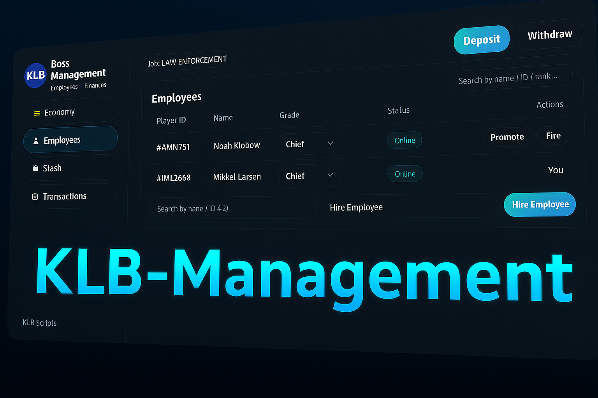

# 🚀 QB / KLB Management — Release

The reworked version of **qb-management** is finally here!  
We’ve kept the original **QBCore functionality**, but completely rebuilt the **UI and user experience** from scratch — now in full **KLB style**.

---

## 💼 Features
- Fully redesigned modern UI  
- Boss & gang management panels  
- Company bank: deposit / withdraw  
- Employee management (hire, fire, promote)  
- Clean transaction & stash overview  

---

## ⚙️ Installation
**Plug & Play** — easy to install and ready to use.  
No database reset required — simply copy your old config and paste it into the new one for locations.

```bash
# Example installation
1. Download or clone this repo
2. Replace your old qb-management folder
3. Copy your old config values into the new config.lua
4. Restart your server
```

---

## 🖤 Credits
- **Original core logic:** [QBCore Framework](https://github.com/qbcore-framework)  
- **UI Rework & Design:** *Klobow (KLB)*  

---

### 📸 Preview


---

### 🧠 Notes
This version focuses purely on **visual overhaul and user experience** improvements —  
all backend logic remains true to the original QBCore system for full compatibility.

---
